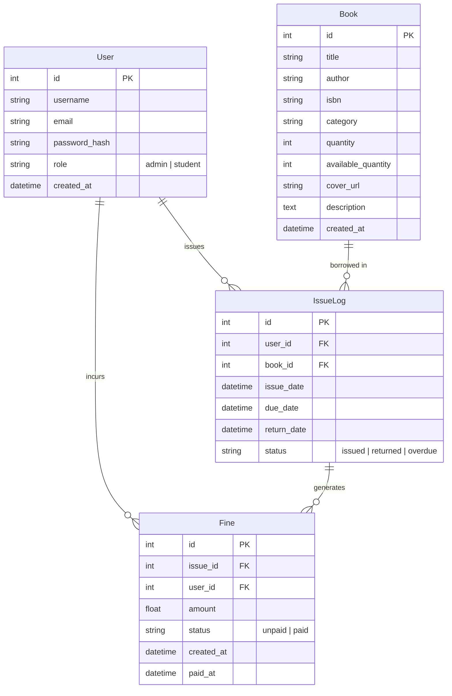

# 📚 Bibliotheca - Full-Stack Library Management System


Bibliotheca is a modern, responsive full-stack web application for managing library operations, catalog management, circulation records, user authentication, and automated overdue fine tracking. Built with **Flask**, **Flask-SQLAlchemy**, **Flask-Login**, and **Bootstrap 5** with a sleek glassmorphism design system.

---

## 🚀 Key Features

### 🔐 User Authentication & Authorization
- **Role-Based Access Control**: Separate privileges for **Administrators** and **Student Members**.
- **Secure Password Hashing**: Powered by Werkzeug security helpers.
- **Session Management**: Built using Flask-Login with persistent login states and role-restricted routes.

### 📖 Catalog & Book Management
- **Search & Filter**: Search books in real time by Title, Author, or ISBN, with category filter tags.
- **Stock Tracking**: Automated tracking of total quantity vs. real-time available stock.
- **Admin CRUD**: Interactive forms for adding, editing, and deleting book records.

### 🔄 Book Circulation & Issue System
- **14-Day Borrowing Period**: Auto-computes due dates upon issuing books.
- **Real-Time Stock Updates**: Decrements available stock on issue and restores stock on return.
- **User Limits**: Prevents double-borrowing of the same book by a student while on active issue.

### 💰 Automated Fine Calculation & Payment
- **Overdue Engine**: Auto-detects overdue loans and calculates daily fine rates ($1.00 / day).
- **Settlement System**: Allows members and administrators to track fine balances and process payments directly.

### 📊 Role-Aware Dashboards
- **Admin Dashboard**: Executive analytics metrics (Total Catalog, Members Count, Active Loans, Total Unpaid Fines) and recent circulation feeds.
- **Student Dashboard**: Quick overview of active loans, due date status badges, total outstanding fine alerts, and borrowing history.

---

## 🛠️ Technology Stack

- **Backend**: Python 3, Flask
- **ORM & Database**: Flask-SQLAlchemy (SQLite database)
- **Authentication**: Flask-Login, Werkzeug Security
- **Frontend**: HTML5, Jinja2 Templates, Bootstrap 5, Bootstrap Icons
- **Styling**: Custom CSS with Glassmorphism, CSS Variables, and Micro-animations

---

## 📁 Directory & File Hierarchy

```
library-management-system/
│
├── app.py                   # Main Flask application, routes, and auto-seeding logic
├── models.py                # SQLAlchemy models (User, Book, IssueLog, Fine)
├── README.md                # Comprehensive project documentation
├── .gitignore               # Ignored files (venv, SQLite DB, cache)
│
├── static/
│   └── css/
│       └── style.css        # Modern glassmorphism CSS design system
│
└── templates/
    ├── base.html            # Base layout with navbar, alerts, and footer
    ├── auth/
    │   ├── login.html       # Login page with demo credentials helper
    │   └── register.html    # Student registration form
    ├── dashboard/
    │   ├── admin.html       # Administrator analytics dashboard
    │   └── student.html     # Student member dashboard
    ├── books/
    │   ├── list.html        # Book catalog with search & filters
    │   ├── detail.html      # Book detail view & issue trigger
    │   └── form.html        # Add / Edit book form
    ├── issues/
    │   └── list.html        # Circulation logs and return triggers
    └── fines/
        └── list.html        # Fine records and settlement actions
```

---

## 🗄️ Database Schema Design



---

## ⚡ Setup & Running Instructions

### Prerequisites
- Python 3.8 or higher installed on your system.

### 1. Clone the Repository
```bash
git clone https://github.com/987Prathiksha/library-management-system.git
cd library-management-system
```

### 2. Create and Activate Virtual Environment
```bash
# On Windows:
python -m venv venv
venv\Scripts\activate

# On macOS/Linux:
python3 -m venv venv
source venv/bin/activate
```

### 3. Install Required Dependencies
```bash
pip install Flask Flask-SQLAlchemy Flask-Login
```

### 4. Launch the Application
```bash
python app.py
```

Open your browser and navigate to: **`http://127.0.0.1:5000`**

---

## 🔑 Default Credentials

The database initializes automatically with sample data and the following pre-configured credentials:

| Role | Username | Password |
| :--- | :--- | :--- |
| **Administrator** | `admin` | `admin123` |
| **Student Member** | `student` | `student123` |

---

## 📜 License

This project is open-source and available under the [MIT License](LICENSE).
